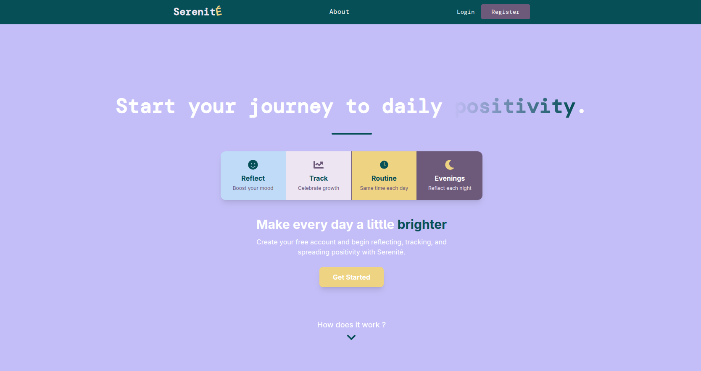

# Serenite — A Minimalist Happiness Journal App [WIP]



*“Track the things that make you happy. One day at a time.”*

---

## Introduction

Serenite is an open-source, full-stack web application designed to help users reflect on positive daily experiences and build mindful habits. The app provides a frictionless way to log "entries" describing what made you happy and why—allowing you to visualize your personal progress and streaks over time.

**Features:**
- Daily entries: log your moments of happiness and why they mattered
- Running streaks and motivational dashboard
- Positive quote delivered daily via external API
- Modern, responsive design

---

## Tech Stack

- **Backend:** Golang with standard library utilities
  - RESTful API
  - JWT Authentication
  - PostgreSQL (end-to-end encrypted data)
  - Organized by layered folder structure (`cmd`, `internal`, `config`)
- **Frontend:** React (TypeScript) + Vite + Tailwind CSS
  - Auth context, protected routes, modular dashboard components
  - Eslint, PostCSS, Caddy (static server)
- **Database Migrations:** SQL migration files (in `/migrations`)
- **Containerization/Orchestration:** Docker + Docker Compose
  - Backend and frontend each have their own Dockerfile
  - Combined orchestration via `docker-compose.yml`

---

## Project Structure

```
serenite/
├── backend       # Go backend REST API
├── frontend      # React + Vite frontend web app
├── migrations    # SQL database migrations
├── docker-compose.yml
└── README.md     # You are here!
```

- **backend/**: Main server code and entrypoint (see its README for usage and API)
- **frontend/**: Client code, context providers, pages, dashboard
- **migrations/**: All DB schema changes (run automatically on backend startup)
- **docker-compose.yml**: Orchestrates multi-container dev setup

---

## Quickstart: Building in Docker

To run **both backend and frontend** in containers:

```bash
docker-compose up --build
```

This launches:
- **Backend** (Go, listening on port 8080)
- **Frontend** (React, served via Caddy, on port 3000)
- Database migrations are executed automatically.

#### Requirements:
- [Docker](https://www.docker.com/get-started) and [Docker Compose](https://docs.docker.com/compose/) installed

> For local development without Docker, refer to each subdirectory's README for manual instructions.

---

## Attributions

- Quotes powered by [ZenQuotes.io](https://zenquotes.io/)
